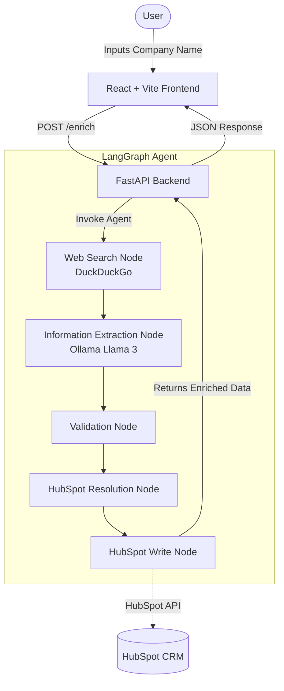

# LangGraph CRM Agent

This project is an intelligent, full-stack CRM enrichment application powered by **LangGraph** and **Ollama (Llama 3)**. It takes a company name as input, autonomously searches the web for relevant context, uses a local AI model to extract structured data (industry, size, tech stack, recent news), and seamlessly synchronizes this enriched data with your HubSpot CRM.

## Architecture

The application is built with a React frontend, a FastAPI backend, and a LangGraph-based agentic workflow. All AI inference is run locally using Ollama, ensuring 100% data privacy for your data processing.




## Prerequisites

- Node.js (v18+)
- Python (v3.10+)
- [Ollama](https://ollama.com/) with the `llama3` model pulled (`ollama pull llama3`)
- A HubSpot account and Access Token (optional, mock mode is supported)

## Setup and Running

### 1. Backend Setup

1. Open a terminal and navigate to the `backend` directory:
   ```bash
   cd backend
   ```
2. Create a virtual environment and activate it:
   ```bash
   python -m venv venv
   .\venv\Scripts\activate  # Windows
   source venv/bin/activate # macOS/Linux
   ```
3. Install dependencies:
   ```bash
   pip install -r requirements.txt
   ```
4. Copy `.env.example` to `.env` and add your HubSpot access token if you have one.
5. Start the FastAPI server:
   ```bash
   python main.py
   ```
   The backend will run on `http://localhost:8000`.

### 2. Frontend Setup

1. Open a new terminal and navigate to the `frontend` directory:
   ```bash
   cd frontend
   ```
2. Install dependencies:
   ```bash
   npm install
   ```
3. Start the Vite development server:
   ```bash
   npm run dev
   ```
   The frontend will run on `http://localhost:5173` (or the port Vite provides).

## Features

- Local, private AI processing using Ollama (Llama 3)
- Fully functioning React frontend with modern UI
- FastAPI backend using LangGraph for AI workflows
- Seamless HubSpot CRM integration

## What Was Hard

The most challenging part of this project was ensuring robust resolution of ambiguous company names before writing to HubSpot. Since web search results can often be noisy or refer to different entities with similar names, getting the LLM to consistently extract the correct domain and matching that against existing CRM records required careful prompt engineering and a reliable validation step in the LangGraph workflow.

## What I'd Fix Given Another Week

With more time, I would:
1. **Implement Human-in-the-Loop (HITL):** Add a step in the LangGraph workflow that pauses and asks the user for confirmation via the UI if the confidence score for the extracted data is too low.
2. **Expand the CI/CD Pipeline:** Add automated tests for the LangGraph nodes and set up GitHub Actions to deploy the FastAPI backend and React frontend.
3. **Advanced Rate Limiting & Retry Logic:** Make the agent more resilient against third-party API rate limits (like DuckDuckGo and HubSpot) by implementing exponential backoff.
